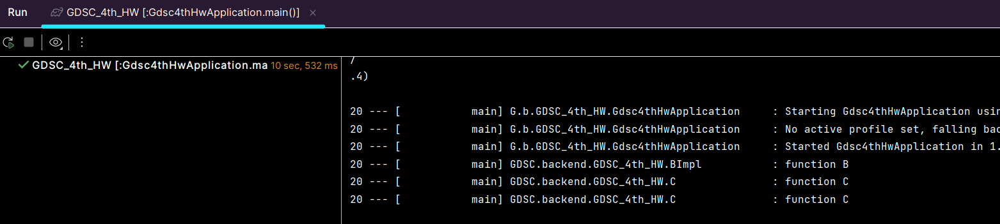

## DI 
- Dependency Injection
- 의존성 주입
- 외부에서 두 객체 간의 관계를 결정해주는 디자인 패턴
- 간편하게 의존성 주입하는 방법 : @Autowired
  - 스프링이 자동으로 해당 클래스의 객체를 찾아 의존성 주입
```java
@Component
public class Pizza {
    @Autowired
    private Cheese cheese;
}
```

### 의존 관계 주입 방법
##### 1. 생성자 주입
- 생성자를 통해 의존 관계 주입
- 객체의 최초 생성 시점에 스프링이 의존성 주입
- 생성자가 1개일 경우 @Autowired 를 생략해도 의존성 주입 가능
- @Autowired 가 붙은 생성자가 여러 개 있을 경우 가장 많은 의존성을 주입할 수 있는 것으로 의존성 주입
```java
@Component
public class Pizza {
    private Cheese cheese;

    @Autowired // 생략 가능
    public Pizza(Cheese cheese, Bread bread) {
        this.cheese = cheese;
    }
}
```

##### 2. setter 주입
- 선택/변경 가능성이 있는 의존 관계에 사용
- setter 메서드에 @Autowired 붙이면 스프링이 자동으로 의존성 주입
```java
@Component
public class Pizza {
    private Cheese cheese;

    public void setCheese(Cheese cheese) {
        this.cheese = cheese;
    }
}
```

##### 3. 필드 주입
- 비추천
- 의존성이 프레임워크에 강하게 종속된다는 문제점
- 실제 코드와 관계 없는 테스트 코드 or 스프링 설정을 목적으로 하는 @Configuration 에서만 사용
```java
@Component
public class Pizza {
    @Autowired
    private Cheese cheese;
}
```

##### 4. 일반 메소드 주입
- 잘 사용하지 않음
- 한 번에 여러 필드 주입 받음
```java
@Component
public class Pizza {
    private Cheese cheese;
    private Bread bread;

    @Autowired
    public void init(Cheese cheese, Bread bread) {
        this.cheese = cheese;
        this.bread = bread;
    }
}
```

### DI 주의점
##### 1. NullPointerException 방지
- setter 주입이나 필드 주입 시 발생 가능
  - 스프링의 빈 관리 기능을 빌리지 않고 new 키워드로 객체를 생성할 경우
- 생성자 주입은 객체 생성 시점에 모든 의존성을 주입해주므로 발생하지 않음

##### 2. 순환참조 문제 방지
- A 객체가 B 객체를 의존하는 동시에, B 객체가 A 객체를 의존
- 생성자/setter/필드 주입으로 의존성 주입 시 에러 메세지 반환

### 주입 대상이 여러 개일 경우
```java
@Component
public class Pizza {
    private Cheese cheese;
    private Bread bread;

    public Pizza(Cheese cheese, Bread bread) {
        this.cheese = cheese;
        this.bread = bread;
    }
}
```
```java
public interface Cheese {
}
@Component
public class CheddarCheese implements Cheese{
}
@Component
public class MozzarellaCheese implements Cheese{
}
```

- 우선순위 : 타입 ➡️ 이름
  
1. 타입 기준 Bean 검색
2. Bean 이름 기준 의존성 주입
   - 메소드의 매개변수명 = 등록된 Bean 이름

##### 1. @Qualifier : Bean 구분자 지정
```java
@Component
@Qualifier("defaultCheese")
public class MozzarellaCheese implements Cheese {
}
```
```java
@Component
public class Pizza {
    private Cheese cheese;
    private Bread bread;

    public Pizza(@Qualifier("defaultCheese") Cheese cheese, Bread bread) {
        this.cheese = cheese;
        this.bread = bread;
    }
}
```

##### 2. @Primary : 의존성 검색 시 우선적 주입
```java
@Component
@Primary
public class MozzarellaCheese implements Cheese {
}
```
```java
@Component
public class Pizza {
    private Cheese cheese;
    private Bread bread;

    public Pizza(Cheese cheese, Bread bread) {
        this.cheese = cheese;
        this.bread = bread;
    }
}
```

- 우선순위 : 타입 ➡️ @Qualifier ➡️ @Primary ➡️ 이름(변수명)

##### 3. Lombok
- 생성자 주입 자동 설정
- @NoArgsConstructor : 파라미터가 없는 기본 생성자 생성
- @RequiredArgsConstructor : final 또는 @NonNull 로 표시된 필드만을 파라미터로 하는 생성자 생성
```java
@Component
@RequiredArgsConstructor
public class Pizza {
    private final Cheese cheese;
    private final Bread bread;
}
```
- @AllArgsConstructor : 모든 필드 값을 파라미터로 받는 생성자 생성
```java
@Component
@AllArgsConstructor
public class Pizza {
    private Cheese cheese;
    private Bread bread;
}
```

## Spring Boot
### Spring Boot 가 만들어진 이유
- 기존 자바 엔터프라이즈 에디션 경량화
- 기존 : 무거운 개발 구성, 프로젝트 시작 시 많은 설정 필요

### Spring Boot 란?
- 스프링 기반 프레임워크
- 어플리케이션 빠른 개발 및 실행
- 개발자의 편리한 스프링 사용 도모

### Spring Boot 특징
1. WAS : 웹 서버 내장
2. 라이브러리 관리 : 스타터 종속성 제공 및 라이브러리 버전 관리
3. 자동 구성 : 프로젝트 시작 시 필요한 빈 자동 등록, 애플리케이션 기능 자동 구성
4. 외부 설정 : 환경에 따른 외부 설정 공통화
5. 프로덕션 준비 : 모니터링을 위한 메트릭 상태 확인 기능 제공

## 4주차 과제
