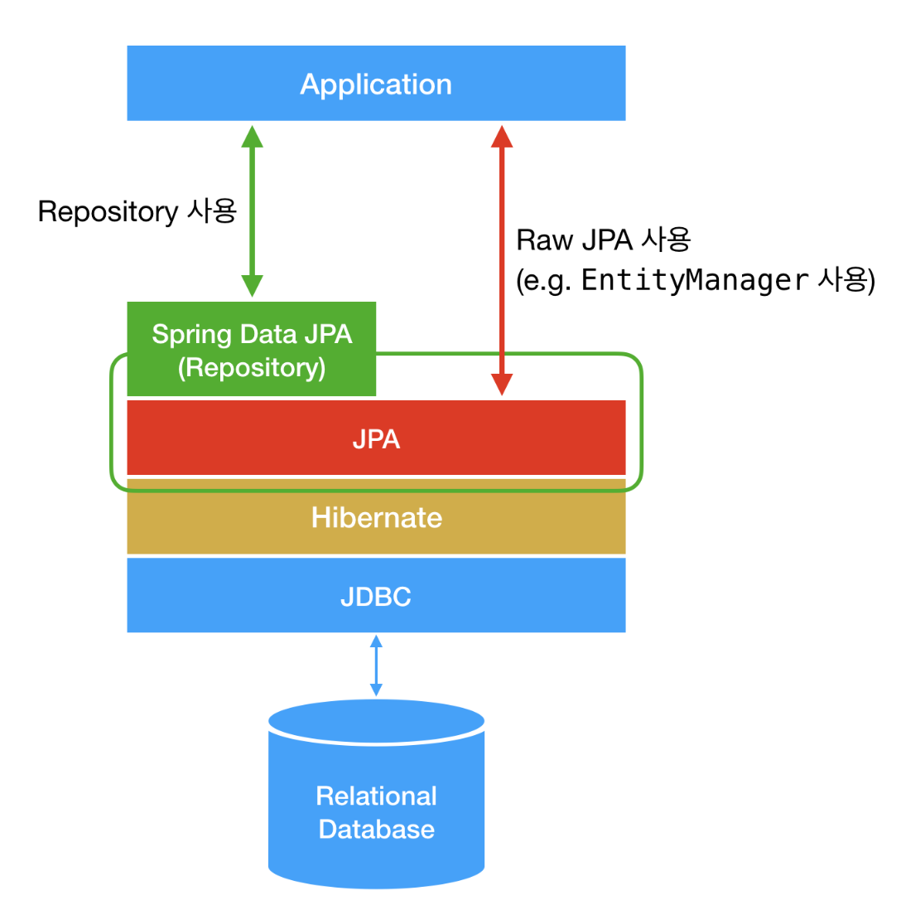
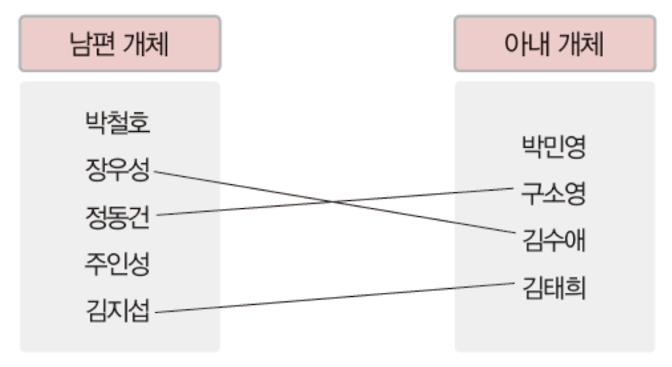
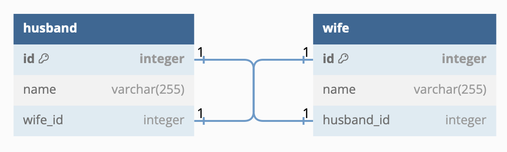
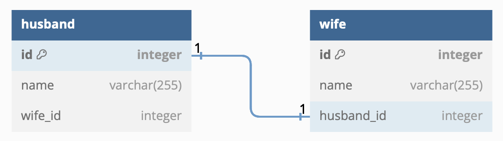
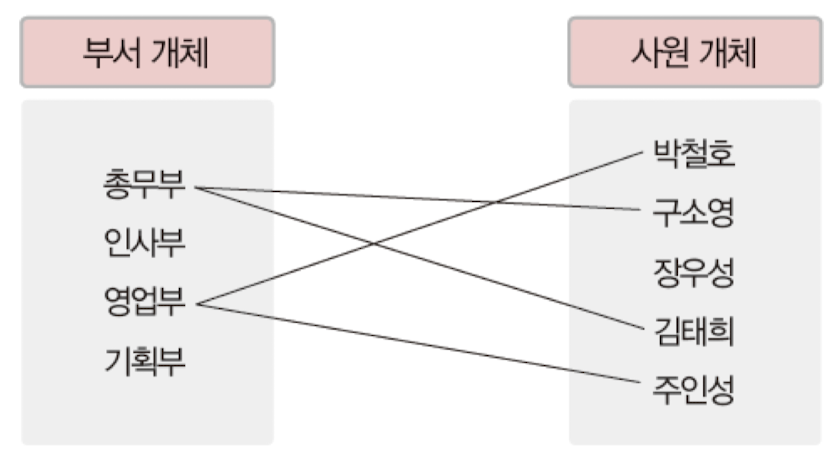
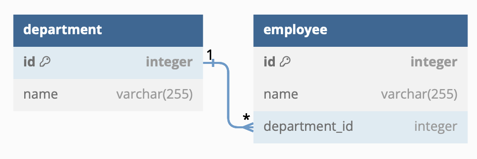
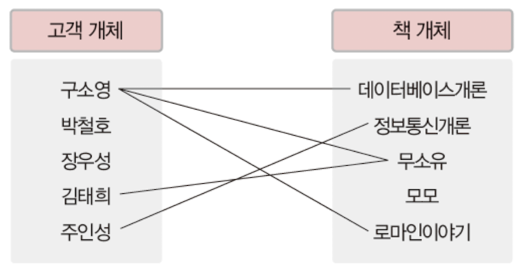
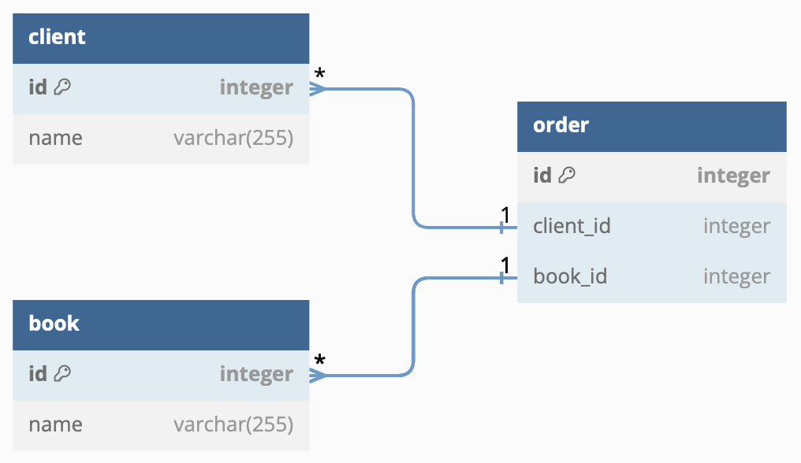

# DB
- 여러 사용자가 공유하여 사용할 수 있도록 통합해서 저장한 운영 데이터의 집합
- 자료를 저장하는 방식
  - SQL
  - NoSQL

## SQL
= RDB (Relational DataBase)

- 데이터는 정해진 데이터 스키마에 따라 테이블에 저장됨
  - 스키마를 준수하지 않은 레코드는 테이블에 추가할 수 없음
  - 스키마 : 데이터베이스 구조에 관한 메타 데이터 (=명세)
- 데이터는 관계를 통해 여러 테이블에 분산됨
- 중복 데이터는 저장 안됨 → 무결성 보장

➡️ 수정이 빈번하고, 구조와 중요도가 높을 경우 사용  

ex) MySQL, MsSQL, Oracle

## NoSQL
- 스키마, 관계가 없는 자료 형식
- 관련 데이터를 동일한 '컬렉션'에 넣음

➡️ 유연한 구조, 빠른 속도, 확장이 편리해야 할 경우 사용  

ex) MongoDB, Redis

---
# ORM
## Entity
= 데이터베이스에 넣을 객체

- 구현 방식
```java
@Entity
@NoArgsConstructor(access = AccessLevel.PROTECTED)
public class Member {
    @Id
    @GeneratedValue(strategy = GenerationType.IDENTITY)
    private Long id;

    @OneToMany(fetch = FetchType.LAZY)
    private List<Feed> feeds;

    private String name;
}
```

## ORM
Object-Relational Mapping  
= 데이터베이스와 객체 지향 프로그래밍 언어 사이의 관계형 데이터를 객체로 매핑하는 기술이나 프로그래밍 기술

- 객체(Entity)를 데이터베이스의 데이터 형식으로 바꿔 저장해주는 역할
- SQL 을 작성하지 않아도 데이터 조작 가능

ex) Hibernate, EclipseLink, DataNucleus

### ORM 의 장점
1. 추상화 : 데이터베이스와의 상호 작용을 객체 지향적인 방식으로 처리 가능
2. 데이터베이스 독립성 : 다양한 데이터베이스 시스템에 대해 동일한 코드 사용 가능
3. 생산성 : SQL 쿼리 작성 불필요
4. 유지 보수 : 코드 변경 시, 객체 모델만 수정

### ORM 의 단점
1. 성능 : 개발자가 작성한 쿼리보다 비효율적일 수 있음
2. 복잡성 : 복잡한 쿼리나 특정 데이터베이스 최적화 기술 사용 시 ORM 을 벗어나야 할 수도 있음

---
# JPA
Java Persistence API  
= 자바 애플리케이션에서 관계형 데이터베이스를 사용하는 방법을 정의한 자바 API (주로 스프링에서 많이 사용)

- 자바 ORM 기술에 대한 표준 사양
- 객체와 데이터베이스 테이블 간 매핑 처리


→ JDBC : 데이터베이스 연결 및 SQL 쿼리 수행을 위한 낮은 수준의 API 제공 (개발자가 직접 SQL 쿼리 작성 후 실행)  
→ Hibernate : JPA 에 대한 구현체 (JPA = 인터페이스)

### 특징
1. 객체-테이블 매핑 : 어노테이션 또는 XML 을 사용하여 자바 객체와 데이터베이스 테이블 매핑
2. 쿼리 언어 사용 : JPQL 객체지향 쿼리 언어를 제공하여 데이터베이스에 질의 가능
3. 생명주기 관리 : 엔티티의 생명 주기 (CRUD) 관리
4. 캐싱 : 기본적인 캐시 전략 지원
5. 자동 스키마 생성 : 데이터베이스 스키마 자동 생성, 업데이트

## Mapping
### Entity
- 데이터베이스의 테이블과 자바 클래스를 매핑하는 역할
- 데이터베이스 테이블의 레코드를 객체로 표현
- JPA 를 사용하여 객체 관리
- ERD(Entity-Relation Diagram) 기반 객체 구현
  - ERD : 데이터베이스의 구조에 관한 메타 데이터, 명세
- 객체 간의 관계
  - 1:1
  - 1:N
  - M:N

### 1:1
- 각 개쳬가 서로를 하나만 가질 수 있을 때
- @OneToOne 어노테이션 이용

  

##### 1. 양방향 접근이 가능한 경우

```java
// Husband
@Entity
@NoArgsConstructor(access = AccessLevel.PROTECTED)
public class Husband {
    @Id
    @GeneratedValue(strategy = GenerationType.IDENTITY)
    private Long id;

    @OneToOne
    private Wife wife;

		private String name;
}

// Wife
@Entity
@NoArgsConstructor(access = AccessLevel.PROTECTED)
public class Wife {
    @Id
    @GeneratedValue(strategy = GenerationType.IDENTITY)
    private Long id;

    @OneToOne
    private Husband husband;

    private String name;
}
```

##### 2. 양방향 접근이 필요없을 경우  
→ 객체 안에 객체를 속성으로 넣기 (ERD 에서는 객체의 id 값만 존재)  
→ 객체의 키 값을 저장하여 객체와의 관계 표시


```java
// Husband
@Entity
@NoArgsConstructor(access = AccessLevel.PROTECTED)
public class Husband {
    @Id
    @GeneratedValue(strategy = GenerationType.IDENTITY)
    private Long id;

    private String name;
}

// Wife
@Entity
@NoArgsConstructor(access = AccessLevel.PROTECTED)
public class Wife {
    @Id
    @GeneratedValue(strategy = GenerationType.IDENTITY)
    private Long id;

    @OneToOne
    private Husband husband;

    private String name;
}
```

### 1:N

→ 부서 개체는 여러 자원 개체와 관계를 맺을 수 있지만, 자원 개체는 한 부서 개체와 관계를 맺을 수 있음

##### 1. 양방향 접근 가능
```java
// Department
@Entity
@NoArgsConstructor(access = AccessLevel.PROTECTED)
public class Department {
    @Id
    @GeneratedValue(strategy = GenerationType.IDENTITY)
    private Long id;

    @OneToMany(fetch = FetchType.LAZY)
    private List<Employee> employees;

    private String name;
}

// Employee
@Entity
@NoArgsConstructor(access = AccessLevel.PROTECTED)
public class Employee {
    @Id
    @GeneratedValue(strategy = GenerationType.IDENTITY)
    private Long id;

    @ManyToOne
    private Department department;

    private String name;
}
```
→ 1 에 해당하는 부분 : @OneToMany
→ N 에 해당하는 부분 : @ManyToOne  

##### 2. 한 방향에서만 접근 가능
###### Department 에서 Employee 로의 접근이 불필요한 경우

```java
@Entity
@NoArgsConstructor(access = AccessLevel.PROTECTED)
public class Department {
    @Id
    @GeneratedValue(strategy = GenerationType.IDENTITY)
    private Long id;

    private String name;
}
```

### M:N

→ 고객 개체와 책 개체 모두 서로 다른 여러 개체와 관계를 맺을 수 있는 상황  

##### 1. 문제 상황
```java
// Book
@Entity
@NoArgsConstructor(access = AccessLevel.PROTECTED)
public class Book {
    @Id
    @GeneratedValue(strategy = GenerationType.IDENTITY)
    private Long id;

    @ManyToMany
    private List<Book> books;

    private String name;
}

// Client
@Entity
@NoArgsConstructor(access = AccessLevel.PROTECTED)
public class Client {
    @Id
    @GeneratedValue(strategy = GenerationType.IDENTITY)
    private Long id;

    @ManyToMany
    private List<Client> clients;

    private String name;
}
```
→ @ManyToMany 어노테이션 사용 : DB 내부적으로 새로운 연결 테이블 생성 후 저장

❌ 연결 테이블이 단순 연결로 끝나지 않고 추가 데이터가 들어갈 수 있기 때문에 실무에서 사용 금지

##### 2. 해결 방법
✅ 연결 테이블용 엔티티 추가하기

- Order 엔티티 추가

```java
// Order
@Entity
@NoArgsConstructor(access = AccessLevel.PROTECTED)
public class Order {
    @Id
    @GeneratedValue(strategy = GenerationType.IDENTITY)
    private Long id;

    @ManyToOne(fetch = FetchType.LAZY)
    private Client client;

    @ManyToOne(fetch = FetchType.LAZY)
    private Book book;
}

// Book
@Entity
@NoArgsConstructor(access = AccessLevel.PROTECTED)
public class Book {
    @Id
    @GeneratedValue(strategy = GenerationType.IDENTITY)
    private Long id;

    @OneToMany
    private List<Order> orders;

    private String name;
}

// Client
@Entity
@NoArgsConstructor(access = AccessLevel.PROTECTED)
public class Client {
    @Id
    @GeneratedValue(strategy = GenerationType.IDENTITY)
    private Long id;

    @OneToMany
    private List<Order> orders;

    private String name;
}
```
→ Book N - 1 Order  
→ Client N - 1 Order  
→ M:N 관계 표현 가능

## Spring Data JPA
= 데이터 접근 계층을 쉽게 구현할 수 있도록 지원하는 모듈 (Spring Framework 의 일부)

### 특징
1. Repository 인터페이스 : CRUD 연산 추상화 → 개발자는 이 인터페이스를 상속받아 필요한 메서드 선언
2. 쿼리 메서드 : 메서드 이름 분석 후 자동으로 SQL 쿼리 생성
3. Custom Query : @Query 애노테이션으로 사용자 정의 쿼리 작성
4. Pagination and Sorting : 페이징과 정렬 기능
5. Transaction Management : 트랜잭션 관리

##### JPA 를 사용했을 때
```java
public static void main(String[] args) {
        EntityManagerFactory emf = Persistence.createEntityManagerFactory("hello");
        EntityManager em = emf.createEntityManager();
        EntityTransaction tx = em.getTransaction();
        tx.begin();
        try {
        Team team = new Team();
        team.setName("팀A");
        em.persist(team);

        em.flush();
        em.clear();
        tx.commit();
        } catch (Exception e){
        tx.rollback();
        } finally {
        em.close();
        }
        emf.close();
        }
```

##### Spring Data JPA 사용했을 때
```java
public interface UserRepository extends JpaRepository<User, Long> {

    List<User> findByUsername(String username);

    @Query("SELECT u FROM User u WHERE u.email = email")
    User findByEmail(String email);
}
```